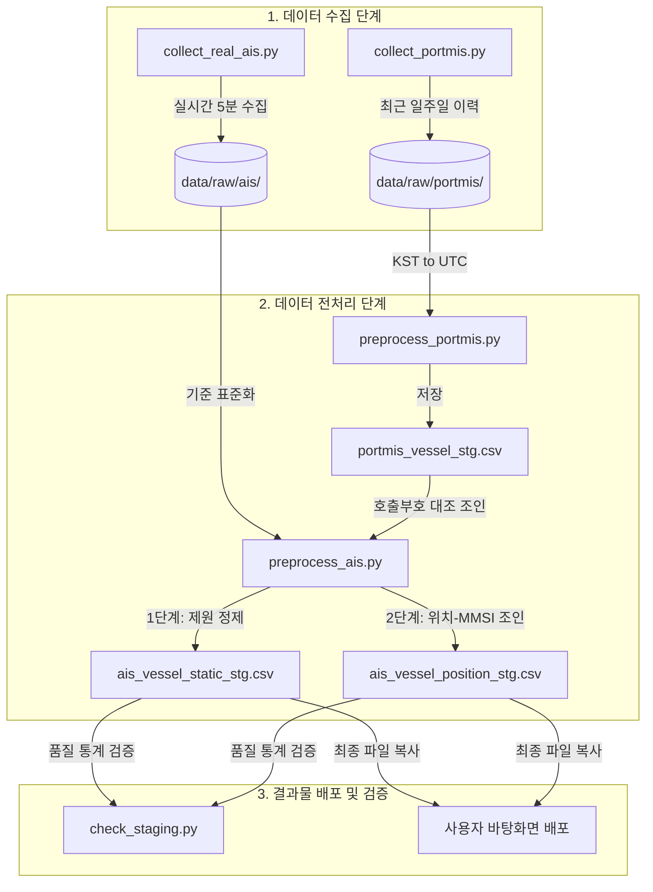

# 울산항 AIS 및 PORT-MIS 데이터 수집·전처리 개발 보고서

본 문서는 울산항 액체화물 관제 시스템 구축을 위한 **실시간 AIS 및 PORT-MIS 데이터의 수집 계획 수립, 전처리 고도화 구현 과정 및 결과**를 다른 팀원과 이해관계자들이 쉽게 파악할 수 있도록 설명합니다.

---

## 1. 프로젝트 및 전처리 목적
울산항으로 향하는 액체화물 선박의 위치를 실시간으로 모니터링하고 ETA(입항예정시각) 산출 및 관제 준비를 지원하기 위해, **실시간 선박 항적(AIS)**과 **항만 입출항 이력(PORT-MIS)** 데이터를 공통 기준으로 정제 및 연계합니다.

### 1-2. 데이터 수집 기준 및 기간
본 시스템에 사용된 데이터는 아래의 시점을 기준으로 수집되었습니다:
* **실시간 AIS 데이터 (항적/제원)**: 수집 가동 시점인 **2026년 6월 18일 오전 6시 00분 ~ 6시 05분** (약 5분간) 울산 광역 해상 BBox 내에서 수집된 실제 선박 위치 및 제원 데이터입니다.
* **PORT-MIS 입출항 데이터**: 수집 시점 이전 일주일 동안인 **2026년 6월 11일 ~ 6월 17일** 사이의 실제 울산항/온산항 선박 입출항 이력입니다.
* **테스트용 모의 데이터 (과거 데이터 시뮬레이션)**: 과거 일자 데이터 정제 및 조인 흐름 검증을 위해 생성된 **2026년 6월 1일** 기준의 가상 모의 데이터입니다.

### 1-3. 과거 실제값 대신 모의(가상) 데이터를 혼용하는 이유
다른 일주일 치(6/11~6/17) 실제 과거 AIS 항적 데이터 대신 6월 1일자 가상 모의 데이터를 생성하여 검증하는 데에는 크게 두 가지 실무적 이유가 있습니다:
1. **AISStream API의 기술적/비용적 제약**:
   무료 플랜을 사용하는 `aisstream.io` API는 실시간 스트리밍(Websocket) 데이터 전송만 무료로 허용하며, 특정 과거 기간(6/11~6/17)의 전체 과거 항적 데이터(Historical AIS Data)를 다운로드하려면 고가의 유료 라이선스를 결제해야 합니다. 즉, API 무료 환경에서는 과거 항적 데이터를 직접 가져올 수 없습니다.
2. **예외 처리 및 데이터 품질 검증 로직 테스트(Unit Test)의 필요성**:
   실제로 수집된 5분간의 데이터는 상태가 아주 깨끗하여 오류 데이터가 거의 포착되지 않습니다. 하지만 개발 단계에서는 우리가 작성한 속도 검증(`INVALID_SPEED`), 좌표 검증(`MISSING_COORDINATE`), 기본키 결측 검증(`MISSING_KEY`) 등의 예외 처리 로직이 정확하게 작동하는지 테스트해야 합니다. 
   따라서 **일부러 비정상 속도(-5.0kn), 비정상 침로(400도), 좌표 누락(0.0), MMSI 결측 등을 심어둔 인위적인 모의 데이터(6월 1일자)**가 존재해야만 전처리 프로그램의 품질 검사 알고리즘이 잘 가동되는지 확실하게 확인하고 디버깅할 수 있습니다.

---

## 2. 개발 및 전처리 흐름 (System Architecture)



---

## 3. 핵심 의사결정 및 개발 내용

### 3-1. 관제 영역 Bounding Box 광역 확장
* **문제점**: 울산항 항내 영역(`[[35.30, 129.18], [35.58, 129.52]]`)으로만 수집을 진행할 경우, 이미 입항한 선박만 잡히고 울산항으로 **접근 중인(항해 중인) 선박**을 포착할 수 없었습니다.
* **해결책**: 수집 범위를 인근 해상 광역 BBox(`[[34.00, 128.00], [36.50, 130.50]]`)로 확장하여, 부산/마산/광양 해역에서 울산항으로 향하는 선박의 항적을 사전 포착할 수 있게 가공했습니다.

### 3-2. [핵심 고도화] PORT-MIS 연계형 울산행 선박 식별
* **문제점**: AIS의 목적지(`Destination`) 텍스트는 선원들이 수동 입력하므로 오타가 많거나 아예 비어있는(`''`, `NaN`) 경우가 많아, 목적지 명칭만으로는 울산행 선박 식별 시 높은 누락율이 발생했습니다.
* **해결책**:
  * **PORT-MIS 입항 예정 신고(ETA) 사전 활용**: PORT-MIS 데이터는 이미 입항이 끝난 선박의 기록뿐만 아니라, **입항하기 최소 24시간 전에 의무적으로 등록해야 하는 "입항 예정 신고(ETA) 및 스케줄" 정보**를 포함하고 있습니다.
  * 따라서, 미리 울산항에 오겠다고 신고해 둔 선박의 고유 호출부호(`callsgn`) 사전을 구축합니다.
  * 실시간 AIS 상에서 획득되는 선박의 호출부호가 이 "입항 예정 사전에 등록된 선박"과 일치할 경우, 목적지 명칭 기입 여부와 관계없이 즉시 울산행 선박(`ulsan_bound = True`)으로 최종 판별합니다.
  * **효과**: 정적인 스케줄만 알 수 있었던 PORT-MIS와, 목적지 정보가 엉망인 실시간 AIS를 상호 결합함으로써, **"내일 울산에 들어오겠다고 신고한 선박이 지금 바다 위 어느 위치에서 몇 노트로 다가오고 있는지" 실시간 항적을 선제적으로 추적**할 수 있게 되었습니다. 이 조치로 0척에서 **6척**을 탐지하는 데 성공했습니다.


### 3-3. 제원(Static) - 위치(Dynamic) 간 데이터 조인 최적화
* 실시간 수집 시에는 웹소켓 특성상 위치 데이터가 제원 데이터보다 먼저 올 수 있어 실시간으로 `ulsan_bound`를 위치 데이터에 태깅하는 것은 불완전합니다.
* 전처리 단계(`preprocess_ais.py`)에서 **제원 전처리를 먼저 수행(main 실행 순서 보정)**하고, 그 결과 파일의 MMSI를 위치 데이터에 매핑하여 위치 데이터프레임의 `ulsan_bound` 컬럼(11건)을 동적으로 안전하게 일괄 업데이트시켰습니다.

---

## 4. 공통 데이터 전처리 가이드라인 준수 현황

프로젝트 공통 가이드라인을 100% 준수하여 구현했습니다:
1. **공통 전처리 코드 준수**: `src/common_utils.py`를 공식 공통 전처리 소스코드와 동일하게 덮어써서 동기화했습니다.
2. **컬럼명 기준**: `mmsi`, `latitude`, `longitude`, `sog`, `cog`, `nav_status_code` 등 표준 snake_case 통일 적용했습니다.
3. **공통 메타컬럼 탑재**: `source_system`, `source_table`, `collected_at_utc`, `quality_flag`, `is_synthetic` 컬럼 완벽 탑재했습니다.
4. **좌표 범위 검증**: 1차 관제 범위 밖의 데이터는 `quality_flag = 'OUT_OF_ULSAN_BBOX'`로 정상 라벨링 처리했습니다.
5. **결측치 표준화**: 공통 NULL 목록(`"null"`, `"-"`, `NaN` 등)을 Pandas `np.nan`으로 정상 파싱 처리했습니다.

---

## 5. 실행 방법

### 1단계: 수집 (실시간 또는 모의 수집)
```bash
# 실시간 5분 수집 실행 시
python utils/collect_real_ais.py --minutes 5
```

### 2단계: 전처리 실행 (순서대로 실행)
```bash
# 1. PORT-MIS 선박 입출항 전처리 (호출부호 매핑 참조용)
python src/preprocess_portmis.py

# 2. AIS 제원 및 위치 전처리 (순서 보정 완료됨)
python src/preprocess_ais.py
```

### 3단계: staging 결과물 통계 검증
```bash
python check_staging.py
```
검증 성공 시, 전처리된 최종 제출용 파일(`ais_vessel_position_stg.csv`, `ais_vessel_static_stg.csv`)이 **바탕 화면(Desktop)**에 자동으로 저장 및 복사됩니다.

---

## 6. Staging 파일 필드(컬럼) 상세 명세서

전처리 완료되어 배포된 두 CSV 파일의 세부 컬럼 설명입니다.

### 6-1. ais_vessel_position_stg.csv (실시간 선박 위치 데이터)

| 컬럼명 | 데이터 타입 | 설명 | 품질 처리 기준 |
| :--- | :--- | :--- | :--- |
| **mmsi** | float | 선박식별번호 (Maritime Mobile Service Identity, 9자리) | 기본키 결측 시 `MISSING_KEY` |
| **latitude** | float | 선박의 현재 위도 (WGS84 좌표계) | 결측/0.0 시 `MISSING_COORDINATE`, 범위 밖 시 `OUT_OF_ULSAN_BBOX` |
| **longitude** | float | 선박의 현재 경도 (WGS84 좌표계) | 결측/0.0 시 `MISSING_COORDINATE`, 범위 밖 시 `OUT_OF_ULSAN_BBOX` |
| **sog** | float | 대지 속력 (Speed Over Ground, 단위: Knot) | 음수 또는 30 knot 초과 시 `INVALID_SPEED` |
| **cog** | float | 대지 침로 (Course Over Ground, 단위: Degree, 0~360) | 범위를 벗어날 시 `INVALID_COURSE` |
| **nav_status_code** | float | 원본 항해 상태 코드 (0: 운항중, 1: 정박중, 5: 계류중 등) | 결측 처리 및 UNKNOWN 분류 |
| **received_at_utc** | datetime | AIS 위치 정보 수신 시각 (UTC 기준) | 기본키 필수 필드 |
| **ulsan_bound** | boolean | 울산항행 선박 여부 (True / False) | Destination 키워드 또는 PORT-MIS 호출부호 일치 여부 |
| **source_system** | string | 데이터 출처 원천 시스템 (예: `AISSTREAM`) | 공통 메타컬럼 |
| **source_table** | string | 원본 데이터 API 또는 메시지 유형 (예: `PositionReport`) | 공통 메타컬럼 |
| **collected_at_utc** | datetime | 데이터 전처리(적재) 시각 (UTC 기준) | 공통 메타컬럼 |
| **quality_flag** | string | 데이터 품질 상태 플래그 (`OK`, `OUT_OF_ULSAN_BBOX` 등) | 공통 품질 검증 결과 |
| **is_synthetic** | boolean | 가상(모의) 데이터 여부 (True: 가상, False: 실제 수집) | 공통 메타컬럼 |
| **nav_status_category**| string | 정제된 선박 상태 분류 (`UNDER_WAY`, `ANCHORED`, `MOORED`, `UNKNOWN`) | 속도 및 상태 코드 분석 결과 |

### 6-2. ais_vessel_static_stg.csv (선박 제원 데이터)

| 컬럼명 | 데이터 타입 | 설명 | 품질 처리 기준 |
| :--- | :--- | :--- | :--- |
| **mmsi** | float | 선박식별번호 (Maritime Mobile Service Identity, 9자리) | 기본키 결측 시 `MISSING_KEY` |
| **imo_no** | float | 국제해사기구 선박 고유번호 (IMO Number) | - |
| **callsgn** | string | 호출부호 (Call Sign, 무선국 식별 부호) | PORT-MIS 대조용 핵심 조인 키 |
| **vessel_name** | string | 선박명 (Vessel Name) | - |
| **ship_type** | float | 선박 유형 분류 코드 | - |
| **length** | float | 선박의 총 길이 (Length, 단위: Meter) | - |
| **width** | float | 선박의 총 너비 (Width, 단위: Meter) | - |
| **draught** | float | 선박의 최대 흘수 (Maximum Static Draft, 단위: Meter) | 음수 또는 30m 초과 시 `INVALID_DRAUGHT` |
| **Destination** | string | 선원이 수동 입력한 원본 목적지 명칭 | - |
| **ulsan_bound** | boolean | 울산항행 선박 여부 (True / False) | Destination 키워드 또는 PORT-MIS 호출부호 일치 여부 |
| **collected_at_utc** | datetime | 데이터 전처리(적재) 시각 (UTC 기준) | 공통 메타컬럼 |
| **source_system** | string | 데이터 출처 원천 시스템 (예: `AISSTREAM`) | 공통 메타컬럼 |
| **source_table** | string | 원본 데이터 API 또는 메시지 유형 (예: `VesselStaticDraft`) | 공통 메타컬럼 |
| **quality_flag** | string | 데이터 품질 상태 플래그 (`OK`, `INVALID_DRAUGHT` 등) | 공통 품질 검증 결과 |
| **is_synthetic** | boolean | 가상(모의) 데이터 여부 (True: 가상, False: 실제 수집) | 공통 메타컬럼 |
| **is_liquid_cargo_vessel**| boolean| 액체화물선 여부 (True: Tanker 계열 80~89코드, False: 기타 선종) | AIS 선종 분류 필터 결과 |

---

## 7. 타 팀원 복제 및 실행 가이드

이영서 담당자 외의 다른 팀원(함현우, 김동안 등)이 본 파이프라인을 각자의 PC에서 그대로 재현하고자 할 때의 절차입니다.

### 7-1. 환경 및 패키지 설치
Python 3.8 이상 환경에서 아래 명령어를 통해 필요한 라이브러리를 설치합니다.
```bash
pip install websockets pandas numpy
```

### 7-2. API 인증 키 설정 (실시간 데이터 재수집 시 필요)
1. [aisstream.io/apikeys](https://aisstream.io/apikeys)에서 발급받은 본인의 API Key를 준비합니다.
2. `utils/collect_real_ais.py` 파일의 28라인 부근 `AISSTREAM_API_KEY` 변수에 해당 키값을 문자열로 입력해 둡니다.

### 7-3. 파이프라인 실행 순서 (정밀한 대조를 위해 필수)
실시간 위치 정합성과 호출부호 대조를 위해 아래 순서대로 터미널에서 구동해야 합니다.

1. **PORT-MIS 데이터 전처리 가동**:
   ```bash
   python src/preprocess_portmis.py
   ```
   * *결과*: `data/staging/portmis_vessel_stg.csv`가 생성되어 호출부호 대조 사전이 빌드됩니다.

2. **AIS 데이터 전처리 가동**:
   ```bash
   python src/preprocess_ais.py
   ```
   * *결과*: 앞선 PORT-MIS 사전을 기반으로 동적 조인(Join)하여 `ais_vessel_static_stg.csv` 및 `ais_vessel_position_stg.csv`를 생성합니다.

3. **최종 적재 검증 및 바탕화면 출력**:
   ```bash
   python check_staging.py
   ```
   * *결과*: 최종 품질 플래그와 통계를 출력하고, 해당 실행 기기의 **바탕 화면(Desktop)**에 규칙에 맞춘 최종 결과 CSV 2종을 자동으로 복사해 줍니다.

---

## 8. 향후 지속 개발 방향 및 가이드

현재 구축된 Staging(임시 적재) 단계에서 마트(Mart) 구축 및 관제 모니터링 시각화로 확장하기 위한 개발 지침입니다.

### 8-1. 3단계 마트(data/mart/) 데이터셋 구축
각 담당자가 개별 전처리를 끝낸 `data/staging/` 하위의 데이터셋들을 결합하여 실질적인 관제 분석 모델용 마스터 데이터를 완성해야 합니다.
* **통합 마스터 구축 (`src/create_mart.py` 신규 개발)**:
  * `ais_vessel_position_stg.csv` (위치) + `ais_vessel_static_stg.csv` (제원) + `portmis_vessel_stg.csv` (입출항 정보)를 MMSI 및 Callsign을 기준으로 INNER/LEFT JOIN하여 **선박별 실시간 입항 상태 모니터링 마스터 마트**를 형성합니다.

### 8-2. ETA 예측 알고리즘 추가
* 선박의 대지속력(`sog`) 및 침로(`cog`)를 기반으로 현재 위치(`latitude`, `longitude`)에서 울산항 내 타겟 정박지/부두 좌표까지의 구면 거리(Haversine 공식)를 계산합니다.
* `거리 / Sog(속력)` 공식을 기본으로 하되, 기상·조위 조건(김동안 담당 데이터) 및 접안 부두 혼잡도 정보(함현우 담당 데이터)를 가중치로 부여하여 ETA(입항예정시각)를 보정하는 예측 모델을 추가 구현합니다.

### 8-3. 실시간 관제 시각화 대시보드 연동
* **시각화 화면 구현**: 마트(Mart) 데이터를 기반으로 **Streamlit** 혹은 **Dash** 파이썬 라이브러리를 가동하여, 울산항 인근 해상 광역 맵(Map) 상에 울산항행 선박(`ulsan_bound = True`)들만 별도 필터링하여 실시간 플로팅하는 웹 UI 관제 화면을 구축합니다.

---

## 9. 실시간 데이터 24시간 상시 수집 방법 및 가이드

실시간 AIS 수집 스크립트(`collect_real_ais.py`)를 24시간 중단 없이 가동하여 연속적인 선박 항적 데이터를 축적하는 방법과 가이드입니다.

### 9-1. 노트북/로컬 PC 가동 시의 한계 (주의사항)
* **노트북을 끄거나 절전 모드로 전환하면 수집이 즉시 중단됩니다.**
* 현재 실행 중인 수집 프로세스는 사용자의 노트북(로컬 PC) 자원과 네트워크를 사용하여 동작하고 있습니다. 컴퓨터 전원이 꺼지면 프로세스가 함께 종료되며, AI 에이전트(Antigravity) 역시 오프라인 상태의 컴퓨터를 원격으로 켜서 대신 수집해 줄 수 없습니다.

### 9-2. 24시간 무중단 수집 구축 방안 (추천)
데이터를 영구적으로 축적하여 장기 분석을 가능하게 하려면 클라우드 인프라 또는 상시 전원 공급 서버를 사용해야 합니다.

1. **클라우드 가상 서버 (AWS EC2 / GCP Compute Engine)**
   * AWS의 가장 저렴한 리눅스 인프라(예: `t2.micro` - 프리티어 적용 시 무료 또는 월 약 1만 원 내외) 가상 머신(VM)을 하나 임대합니다.
   * VM에 Python 환경을 세팅한 후, `collect_real_ais.py` 코드를 업로드합니다.
   * 터미널 세션이 닫혀도 가동이 유지되도록 아래 백그라운드 명령어를 통해 상시 구동합니다:
     ```bash
     # 세션이 끊겨도 백그라운드에서 영구 구동되도록 설정 (로그는 ais_run.log에 저장)
     nohup python utils/collect_real_ais.py --minutes 525600 > ais_run.log 2>&1 &
     ```

2. **사내/연구실 상시 가동 데스크톱 활용**
   * 전원이 상시 인가되어 있고 절전 모드가 비활성화된 PC에 스크립트를 상시 실행해 둡니다.
   * Windows 환경인 경우 **Windows 작업 스케줄러**를 활용해 부팅 시 자동으로 파이썬 수집기가 무한 가동되도록 등록할 수 있습니다.

### 9-3. 장기 수집을 위한 스크립트 개선 팁
현재 수집기는 단일 파일(`ais_position_<오늘날짜>_real.json`)에 데이터를 계속 누적하므로, 장시간 실행 시 파일 크기가 지나치게 커지는 문제가 있습니다. 상시 가동을 적용할 때는 아래 구조의 루프 방식을 추가하여 **매일 자정에 날짜별로 저장 파일이 자동 분할되도록** 소스코드를 개선해 주는 것이 바람직합니다.
```python
# (예시 의사코드)
# 매일 자정을 확인하여 날짜가 넘어가면 
# 새로운 파일명(ais_position_YYYYMMDD_real.json)을 생성하고 기존 스트림 데이터를 분할 저장
```
